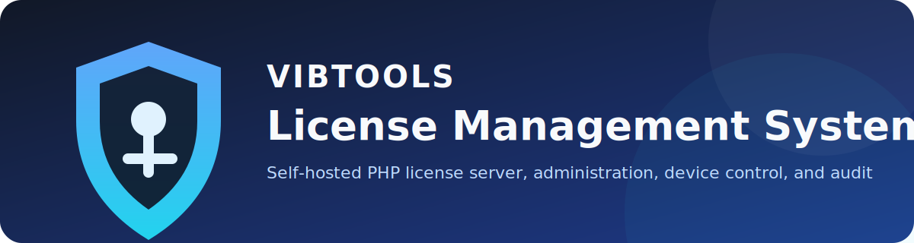
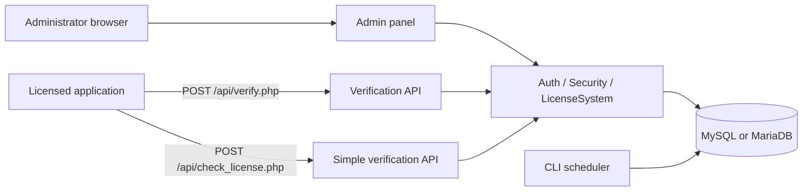

<p align="center">
  
</p>

<p align="center">
  <a href="https://github.com/vibtools/Licora/releases"></a>
  <a href="https://github.com/vibtools/Licora/releases/latest"></a>
  <a href="LICENSE"></a>
  <a href="https://github.com/vibtools/Licora/stargazers"></a>
  <a href="https://github.com/vibtools/Licora/network/members"></a>
  <a href="https://github.com/vibtools/Licora/issues"></a>
  
  
</p>

# Licora

**Licora** is an open-source, self-hosted PHP and MySQL/MariaDB central license management system for issuing software licenses, validating license access, binding licenses to API keys or application scopes, enforcing device limits, administering access, and auditing license activity.

Licora is maintained by **Vib Tools**. Vib Tools is a professional tools and digital services provider operating a secure online tools marketplace. The company provides secure online tools, license delivery, web services, marketing support, business consultation, and customer support for businesses and individuals.

> **Security notice:** this is security-sensitive server software. Review [SECURITY.md](SECURITY.md), [docs/SECURITY_DEPLOYMENT.md](docs/SECURITY_DEPLOYMENT.md), and [audit/FORENSIC_AUDIT_REPORT.md](audit/FORENSIC_AUDIT_REPORT.md) before exposing it to the internet.

## Key capabilities

- License creation with expiration periods, device limits, notes, application scopes, and optional API-key binding.
- API-key management with activation, expiry, request counters, and per-key metadata.
- License verification through a full API endpoint and a legacy/simple endpoint.
- Device registration, activity tracking, revocation, blacklist handling, and risk indicators.
- Role-aware admin panel for super administrators, managers, and viewers.
- Audit trail, operational logs, CSV exports, SQL backup generation, and health checks.
- CSRF tokens for admin mutations, prepared SQL statements, password hashing, rate limiting, and session hardening.
- Scheduled cleanup and expiring-license reporting through CLI cron scripts.

## Screenshots

Screenshots are intentionally left as release placeholders so deployments do not publish real license keys, API keys, device fingerprints, IP addresses, or admin identities.

| Dashboard | License management | API-key management |
|---|---|---|
| `assets/screenshots/dashboard.png` | `assets/screenshots/licenses.png` | `assets/screenshots/api-keys.png` |

See [assets/screenshots/README.md](assets/screenshots/README.md) for the safe screenshot checklist.

## Architecture



The application is a server-rendered PHP project with no Composer runtime dependency. UI assets are loaded from public CDNs. See [docs/ARCHITECTURE.md](docs/ARCHITECTURE.md).

## Requirements

- PHP 8.0 or later with `pdo_mysql`, `openssl`, and `json`.
- MySQL or MariaDB with InnoDB and `utf8mb4` support.
- Apache with `.htaccess` enabled, or an equivalent Nginx configuration.
- HTTPS for every non-local deployment.
- A CLI scheduler for `cron/cleanup.php` and `cron/check_expiring.php`.

## Quick start

1. Place the project in a non-public staging environment.
2. Create an empty database and import `database.sql`, or open `install.php` once.
3. Configure `includes/config.local.php` or environment variables.
4. Sign in at `admin/login.php` using the temporary local-only account:
   - Username: `admin`
   - Password: `ChangeMe!2026`
5. Change the password immediately from **Admin Users**.
6. Delete or deny access to `install.php`.
7. Configure HTTPS, cron, backups, and web-server deny rules before production use.

Complete steps: [docs/INSTALLATION.md](docs/INSTALLATION.md).

## API quick example

Use the full endpoint for new integrations:

```bash
curl --request POST "https://example.com/license-system/api/verify.php" \
  --header "Content-Type: application/json" \
  --header "X-API-Key: YOUR_API_KEY" \
  --data '{
    "license_key": "AAAAAAAA-BBBBBBBB-CCCCCCCC-DDDDDDDD",
    "device_hash": "stable-client-generated-device-id",
    "app_id": "desktop-client",
    "app_version": "1.0.0"
  }'
```

`X-API-Key` is the recommended authentication header for the current release. See [docs/API.md](docs/API.md) for endpoint behavior, response fields, and integration warnings.

## Configuration

The application accepts deployment-specific values through environment variables. A private `includes/config.local.php` file can override the same constants and is excluded by `.gitignore`.

| Purpose | Preferred variable | Default |
|---|---|---|
| Database host | `LICENSE_DB_HOST` | `localhost` |
| Database name | `LICENSE_DB_NAME` | empty |
| Database user | `LICENSE_DB_USER` | empty |
| Database password | `LICENSE_DB_PASS` | empty |
| Application URL | `APP_URL` | `http://localhost` |
| Environment | `APP_ENV` | `production` |
| Encryption key | `LICENSE_ENCRYPTION_KEY` | empty fallback |
| API limit | `API_RATE_LIMIT` | `1000` |
| Allowed browser origin | `LICENSE_ALLOWED_ORIGIN` | `APP_URL` |

Full reference: [docs/CONFIGURATION.md](docs/CONFIGURATION.md).

## Validation

```bash
bash scripts/validate.sh
```

The validation script checks PHP syntax, JavaScript syntax when Node.js is available, public-release secret markers, expected repository files, and the built-in security smoke test. Database-backed behavior requires a disposable MySQL/MariaDB instance and is not simulated by the static validation suite.

## Documentation

- [Installation](docs/INSTALLATION.md)
- [Configuration](docs/CONFIGURATION.md)
- [API reference](docs/API.md)
- [Architecture](docs/ARCHITECTURE.md)
- [Database](docs/DATABASE.md)
- [Feature matrix](docs/FEATURE_MATRIX.md)
- [Developer guide](docs/DEVELOPMENT.md)
- [Build and validation](docs/BUILD.md)
- [Maintenance](docs/MAINTENANCE.md)
- [Release guide](docs/RELEASE.md)
- [Troubleshooting](docs/TROUBLESHOOTING.md)
- [v5.0.1 release notes](RELEASE_NOTES-v5.0.1.md)
- [v5.0.0 release notes](RELEASE_NOTES.md)
- [Forensic audit](audit/FORENSIC_AUDIT_REPORT.md)
- [Privacy validation](audit/PRIVACY_VALIDATION_REPORT.md)
- [Dependency review](audit/DEPENDENCY_REPORT.md)

## Known limitations

The audit intentionally records unresolved behavior rather than silently changing application logic. Important items include a legacy unauthenticated verification endpoint, Bearer-header parsing inconsistencies, an unused session-timeout method, settings that are stored but not enforced, unauthenticated encryption, destructive admin actions implemented through query strings, and CDN supply-chain exposure. Review the audit before production deployment.

## Roadmap

See [ROADMAP.md](ROADMAP.md). Roadmap entries are proposals, not commitments, and should be implemented in feature-preserving pull requests with migration and rollback notes.

## Contributing

Read [CONTRIBUTING.md](CONTRIBUTING.md), [CODE_OF_CONDUCT.md](CODE_OF_CONDUCT.md), and [docs/CODING_STANDARDS.md](docs/CODING_STANDARDS.md). Security findings must follow [SECURITY.md](SECURITY.md), not public issues.

## Support

Use GitHub Issues for reproducible defects and `support@vib.tools` for private security or project-support questions. See [SUPPORT.md](SUPPORT.md).

## Maintained by Vib Tools

- **Company:** Vib Tools
- **Official website:** https://vib.tools/
- **GitHub organization:** https://github.com/vibtools
- **Support:** support@vib.tools

Vib Tools provides secure online tools, license delivery, web services, marketing support, business consultation, and professional digital services. These references identify the project maintainer and do not imply endorsement of third-party deployments.

## License

The software is released under the [MIT License](LICENSE). The Vib Tools name and branding are addressed separately in [NOTICE](NOTICE).
