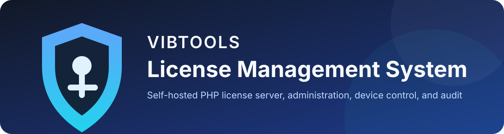
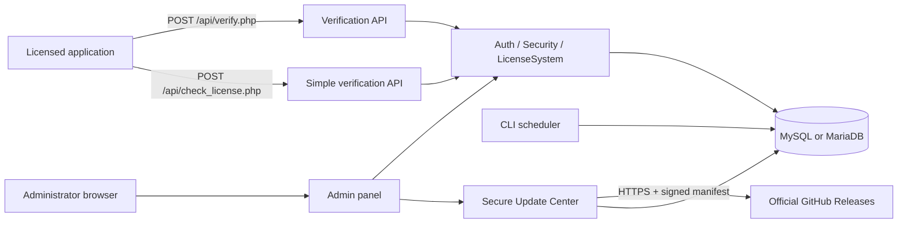

<p align="center">
  
</p>

<p align="center">
  <a href="https://github.com/vibtools/Licora/releases"></a>
  <a href="https://github.com/vibtools/Licora/releases/latest"></a>
  <a href="LICENSE"></a>
  <a href="https://github.com/vibtools/Licora/stargazers"></a>
  <a href="https://github.com/vibtools/Licora/network/members"></a>
  <a href="https://github.com/vibtools/Licora/issues"></a>
  
  
</p>

# Licora

**Licora** is an open-source, self-hosted PHP and MySQL/MariaDB central license management system for issuing software licenses, validating license access, binding licenses to API keys or application scopes, enforcing device limits, administering access, and auditing license activity.

Licora is maintained by **Vib Tools**. Vib Tools is a professional tools and digital services provider operating a secure online tools marketplace. The company provides secure online tools, license delivery, web services, marketing support, business consultation, and customer support for businesses and individuals.

> **Security notice:** this is security-sensitive server software. Review [SECURITY.md](SECURITY.md), [docs/SECURITY_DEPLOYMENT.md](docs/SECURITY_DEPLOYMENT.md), and [audit/FORENSIC_AUDIT_REPORT.md](audit/FORENSIC_AUDIT_REPORT.md) before exposing it to the internet.

## Key capabilities

- License creation with expiration periods, device limits, notes, application scopes, and optional API-key binding.
- API-key management with activation, expiry, request counters, and per-key metadata.
- License verification through a full API endpoint and a legacy/simple endpoint.
- Device registration, activity tracking, revocation, blacklist handling, and risk indicators.
- Role-aware admin panel for super administrators, managers, and viewers.
- Audit trail, operational logs, CSV exports, SQL backup generation, and health checks.
- CSRF tokens for admin mutations, prepared SQL statements, password hashing, rate limiting, and session hardening.
- Scheduled cleanup and expiring-license reporting through CLI cron scripts.
- Super-Admin-only Secure Update Center with signed GitHub release manifests, preflight, staged installation, persistent live logs, migration tracking, and rollback protection.

## Screenshots

Screenshots are intentionally left as release placeholders so deployments do not publish real license keys, API keys, device fingerprints, IP addresses, or admin identities.

| Dashboard | License management | API-key management |
|---|---|---|
| `assets/screenshots/dashboard.png` | `assets/screenshots/licenses.png` | `assets/screenshots/api-keys.png` |

See [assets/screenshots/README.md](assets/screenshots/README.md) for the safe screenshot checklist.

## Architecture


```mermaid
flowchart LR
    Client[Licensed application] -->|POST /api/verify.php| API[Verification API]
    Client -->|POST /api/check_license.php| Legacy[Simple verification API]
    Admin[Administrator browser] --> Panel[Admin panel]
    Panel --> Core[Auth / Security / LicenseSystem]
    API --> Core
    Legacy --> Core
    Core --> DB[(MySQL or MariaDB)]
    Cron[CLI scheduler] --> DB
    Panel --> Updater[Secure Update Center]
    Updater -->|HTTPS + signed manifest| GitHub[Official GitHub Releases]
    Updater --> DB
```

The application is a server-rendered PHP project with no Composer runtime dependency. UI assets are loaded from public CDNs. See [docs/ARCHITECTURE.md](docs/ARCHITECTURE.md).

## Requirements

- PHP 8.0 or later with `pdo_mysql`, `openssl`, and `json`. The in-app updater additionally requires `ZipArchive` and either cURL or HTTPS stream access (`allow_url_fopen`).
- MySQL or MariaDB with InnoDB and `utf8mb4` support.
- Apache with `.htaccess` enabled, or an equivalent Nginx configuration.
- HTTPS for every non-local deployment.
- A CLI scheduler for `cron/cleanup.php` and `cron/check_expiring.php`.

## Quick start

### Fresh installation

1. Place the project in a non-public staging environment.
2. Create an empty MySQL/MariaDB database and a database account with the schema privileges required by `database.sql`, including `TRIGGER`.
3. Open `install.php` or `/install` and complete the ten-step wizard.
4. Create the first administrator in the wizard; no default password is retained after successful wizard installation.
5. Confirm that `includes/config.local.php` and `includes/.licora-installed` were created and are not web-accessible.
6. Sign in at `admin/login.php`, open `admin/health.php`, and complete an API/license/device smoke test.
7. Configure HTTPS, cron, backups, and web-server deny rules before production use.

### Manual import

Importing `database.sql` directly creates a temporary local-only account:

- Username: `admin`
- Password: `ChangeMe!2026`

Change that password immediately and create `includes/config.local.php` from `config.sample.php`.

Complete steps: [docs/INSTALLATION.md](docs/INSTALLATION.md).

## API quick example

API v1 remains available for trusted/legacy integrations:

```bash
curl --request POST "https://example.com/license-system/api/verify.php" \
  --header "Content-Type: application/json" \
  --header "X-API-Key: YOUR_API_KEY" \
  --data '{
    "license_key": "AAAAAAAA-BBBBBBBB-CCCCCCCC-DDDDDDDD",
    "device_hash": "stable-client-generated-device-id",
    "app_id": "desktop-client",
    "app_version": "1.0.0"
  }'
```

`X-API-Key` remains the API v1 authentication header. New desktop/public clients should use Secure API v2, which does not embed a shared Licora API key. See [docs/API.md](docs/API.md) and [docs/API_V2.md](docs/API_V2.md).

## Configuration

The application accepts deployment-specific values through environment variables. A private `includes/config.local.php` file can override the same constants and is excluded by `.gitignore`.

| Purpose | Preferred variable | Default |
|---|---|---|
| Database host | `LICENSE_DB_HOST` | `localhost` |
| Database port | `LICENSE_DB_PORT` | `3306` |
| Database name | `LICENSE_DB_NAME` | empty |
| Database user | `LICENSE_DB_USER` | empty |
| Database password | `LICENSE_DB_PASS` | empty |
| Application name | `APP_NAME` | `Licora` |
| Application URL | `APP_URL` | `http://localhost` |
| Application version | `APP_VERSION` | `5.5.0` |
| Environment | `APP_ENV` | `production` |
| Encryption key | `LICENSE_ENCRYPTION_KEY` | empty fallback |
| API limit | `API_RATE_LIMIT` | `1000` |
| Allowed browser origin | `LICENSE_ALLOWED_ORIGIN` | `APP_URL` |

Full reference: [docs/CONFIGURATION.md](docs/CONFIGURATION.md).

## Validation

```bash
bash scripts/validate.sh
```

The validation script checks PHP syntax, security behavior, compatibility invariants, installer parsing and lock behavior, release-version consistency, safe public errors, JavaScript syntax, public-release secret markers, and SQL seed scope. Database-backed behavior requires a disposable MySQL/MariaDB instance; GitHub CI supplies dedicated MySQL 8.4 API v2 and updater integration gates before source artifacts or tagged releases are produced. Tagged releases also require a signed updater manifest before publication.

## Documentation

- [Installation](docs/INSTALLATION.md)
- [Configuration](docs/CONFIGURATION.md)
- [API reference](docs/API.md)
- [Architecture](docs/ARCHITECTURE.md)
- [Database](docs/DATABASE.md)
- [Feature matrix](docs/FEATURE_MATRIX.md)
- [Developer guide](docs/DEVELOPMENT.md)
- [Build and validation](docs/BUILD.md)
- [Maintenance](docs/MAINTENANCE.md)
- [Release guide](docs/RELEASE.md)
- [Secure in-app updater](docs/UPDATER.md)
- [UI design system](docs/UI_DESIGN_SYSTEM.md)
- [Troubleshooting](docs/TROUBLESHOOTING.md)
- [v5.5.0 release notes](RELEASE_NOTES_v5.5.0.md)
- [v5.4.1 release notes](RELEASE_NOTES_v5.4.1.md)
- [v5.4.0 release notes](RELEASE_NOTES_v5.4.0.md)
- [v5.3.0 release notes](RELEASE_NOTES_v5.3.0.md)
- [v5.2.2 release notes](RELEASE_NOTES_v5.2.2.md)
- [v5.2.1 release notes](RELEASE_NOTES_v5.2.1.md)
- [v5.2.0 release notes](RELEASE_NOTES_v5.2.0.md)
- [v5.1.0 release notes](RELEASE_NOTES_v5.1.0.md)
- [v5.0.1 release notes](RELEASE_NOTES-v5.0.1.md)
- [v5.0.0 release notes](RELEASE_NOTES.md)
- [Forensic audit](audit/FORENSIC_AUDIT_REPORT.md)
- [Privacy validation](audit/PRIVACY_VALIDATION_REPORT.md)
- [Dependency review](audit/DEPENDENCY_REPORT.md)


## VibTools compact UI and Licora branding (v5.5.0)

Licora v5.5.0 refines the existing VibTools Light component architecture into the compact/no-growth presentation contract: full-width data tables, single-row toolbars, compact row actions, responsive Single/Bulk license creation, light themed scrollbars and reusable confirmation/feedback UI. Supplied Licora logos/icons/favicons are now tracked and used across the application shell, login, installer, root landing page and About page.

The Settings page is also made truthful. Only settings consumed by the current runtime remain editable; legacy stored-only values remain in the database for compatibility but are no longer presented as active controls. Runtime/API endpoints, limits, Cron CLI commands and Secure API v2 public-key metadata are read-only operational information. The API v2 private signing key remains server-only and is never displayed or downloadable. No database migration, API protocol change, license/device behavior change, cron behavior change or updater state-machine change is included.

## Updater recovery and scope integrity (v5.4.1)

Licora v5.4.1 is a no-migration corrective release for the v5.3.0 updater and v5.4.0 component UI scopes. It fixes the live updater DOM selector/runtime-resume defect, strengthens browser/runtime contract tests, bounded stream downloads, archive validation, backup/rollback verification and signed release builder/runtime parity. The signed release accepts direct updates from reviewed `5.3.0` and `5.4.0` updater baselines.

## VibTools Light component UI (v5.4.0)

Licora v5.4.0 adopts the audited **VibTools Web UI v2.1.2** structural, typography and spacing system while preserving Licora's light blue/purple visual identity. Authenticated administration now uses a fixed left sidebar plus compact utility topbar; primary menu items are no longer duplicated across a horizontal header. Tablet/mobile layouts use the same sidebar as an off-canvas drawer.

The UI is component-first. `admin/assets/css/admin-ui.css` delegates to the centralized Licora Light theme/layout/component engine, and `admin/includes/navbar.php` remains only as a compatibility entrypoint that renders the shared sidebar/topbar components. New page-specific design stylesheets and page `<style>` blocks are prohibited by the v5.4.0 UI contract tests. Existing routes, form names, CSRF fields, business logic and backend/API/updater contracts are unchanged. See [docs/UI_DESIGN_SYSTEM.md](docs/UI_DESIGN_SYSTEM.md).

## Secure in-app updates (v5.3.0)

Licora v5.3.0 introduces **Admin → Updates** for future stable releases. The updater only accepts assets from the pinned official `vibtools/Licora` GitHub repository, verifies a dedicated RSA/SHA-256 signed manifest, validates the release ZIP and per-file checksums, runs server preflight, stages files outside the application tree, records a rollback backup, applies signed migrations through a migration ledger, updates files in resumable chunks, and performs post-install verification. A critical filesystem lock temporarily returns HTTP 503 to non-updater traffic only while schema/source changes are being applied.

The Update Center uses the VibTools Web UI v2.1.2 token foundation and a real persistent event stream for its deployment-log modal. Search, level filtering, Copy Logs, Download Diagnostics, pin-to-bottom, progress and stage state are backed by actual `update_events` rows; no demo deployment records or fake AI diagnostics are shipped. The normal cPanel/VPS updater path does not require Git, shell access, Composer, Python, `exec()`, or other command execution.

**Bootstrap note:** v5.2.2 cannot install the updater that it does not yet contain. v5.3.0 is therefore the one final manual source replacement. From v5.3.0 onward, compatible signed releases can be installed from the Update Center after preflight passes. See [docs/UPDATER.md](docs/UPDATER.md).

## Secure API v2 (v5.2.2)

Secure API v2, introduced in v5.2.0, hardened in v5.2.1, and given consistent Admin UI schema discovery in v5.2.2, provides `/api/v2/activate.php`, `/refresh.php`, `/status.php`, and `/deactivate.php` for public/desktop clients. It uses registered App IDs, P-256 device keys, RS256 server-signed short-lived access tokens, rotating hashed refresh tokens, nonce/timestamp replay protection, device revocation, matching server signing-key validation, and persistent refresh rate-limit enforcement. API v1 remains unchanged for existing integrations.

Fresh installations provision API v2 during the installer. In v5.2.2, the existing License app-scope selector and V2 Devices page use the same exact schema-discovery contract as API v2 runtime, preventing false-empty/false-provisioning states on compatible hosts. Existing cPanel/shared-hosting deployments can preserve private/runtime files, overwrite the source, then use **Admin → Client Apps → Initialize API v2** without shell access. CLI-capable deployments may instead run `php scripts/setup-v2.php`. Both paths reuse the same additive v5.2.0 schema and never silently replace existing signing key files. See [API v2](docs/API_V2.md), [security model](docs/API_V2_SECURITY.md), [client integration](docs/API_V2_CLIENT_INTEGRATION.md), and [migration](docs/API_V2_MIGRATION.md).

## Known limitations

- The legacy `/api/check_license.php` endpoint remains unauthenticated for compatibility; new desktop/public clients should use Secure API v2.
- Several stored settings remain informational or only partially connected to runtime enforcement.
- The admin interface depends on public CDN assets unless a deployment vendors them locally.
- Nginx and LiteSpeed operators must reproduce the supplied Apache deny rules.
- The standard schema requires database privileges including `TRIGGER`; some free shared hosts do not provide them.
- Production-environment browser smoke testing and host-specific MySQL/MariaDB compatibility remain deployment responsibilities; the repository CI includes a disposable MySQL 8.4 API v2 integration gate.

Review [SECURITY.md](SECURITY.md), [docs/COMPATIBILITY_MATRIX.md](docs/COMPATIBILITY_MATRIX.md), and the forensic audit before production deployment.

## Roadmap

See [ROADMAP.md](ROADMAP.md). Roadmap entries are proposals, not commitments, and should be implemented in feature-preserving pull requests with migration and rollback notes.

## Contributing

Read [CONTRIBUTING.md](CONTRIBUTING.md), [CODE_OF_CONDUCT.md](CODE_OF_CONDUCT.md), and [docs/CODING_STANDARDS.md](docs/CODING_STANDARDS.md). Security findings must follow [SECURITY.md](SECURITY.md), not public issues.

## Support

Use GitHub Issues for reproducible defects and `support@vib.tools` for private security or project-support questions. See [SUPPORT.md](SUPPORT.md).

## Maintained by Vib Tools

- **Company:** Vib Tools
- **Official website:** https://vib.tools/
- **GitHub organization:** https://github.com/vibtools
- **Support:** support@vib.tools

Vib Tools provides secure online tools, license delivery, web services, marketing support, business consultation, and professional digital services. These references identify the project maintainer and do not imply endorsement of third-party deployments.

## License

The software is released under the [MIT License](LICENSE). The Vib Tools name and branding are addressed separately in [NOTICE](NOTICE).
