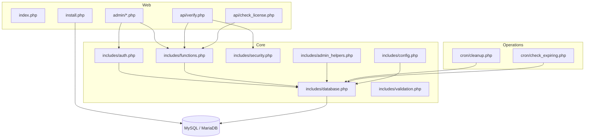

# Architecture

## Overview

The project is a classic server-rendered PHP application. Request handlers include shared classes directly and use a singleton PDO connection to a MySQL-compatible database.

## Request lifecycle

1. `includes/config.php` starts the session, loads a private local override, defines environment-backed constants, configures error handling, and registers a simple class autoloader.
2. `includes/database.php` creates a PDO singleton with exceptions, associative fetches, native prepares, and `utf8mb4`.
3. Admin pages instantiate `Auth`, verify the session, apply role checks through `AdminHelpers`, validate CSRF tokens for most mutations, and call `LicenseSystem` or direct prepared statements.
4. The full API validates origin, method, IP rate limit, API key, JSON body, license state, application/API-key binding, blacklist state, and device capacity.
5. Audit and operational tables capture actions, requests, devices, and failed logins.

## Trust boundaries

- **Browser to admin panel:** session cookie, CSRF token, role checks.
- **Licensed client to API:** API key, license key, device hash, IP rate limit.
- **PHP to database:** PDO credentials and SQL permissions.
- **Scheduler to cron scripts:** operating-system process identity and private file access.
- **Browser to CDNs:** Bootstrap, Bootstrap Icons, Tailwind CDN, and Chart.js.

## State model

Licenses use `active`, `expired`, and `suspended` states. Devices use `is_active` with last-activity timestamps. API keys use `is_active`, optional expiry, application metadata, and request counters. Admin roles are `super_admin`, `manager`, and `viewer`.

## Compatibility principle

Migrations are additive. The code includes fallbacks for older schemas, and repository changes should preserve existing endpoints and database columns unless a versioned migration and rollback are supplied.
