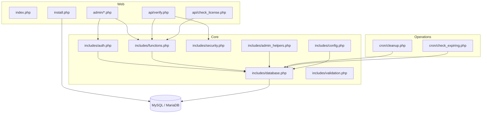

# Architecture

## Overview

The project is a classic server-rendered PHP application. Request handlers include shared classes directly and use a singleton PDO connection to a MySQL-compatible database.


```mermaid
flowchart TB
    subgraph Web
      Root[index.php]
      Installer[install.php]
      Admin[admin/*.php]
      Verify[api/verify.php]
      Simple[api/check_license.php]
    end
    subgraph Core
      Config[includes/config.php]
      DB[includes/database.php]
      Auth[includes/auth.php]
      Security[includes/security.php]
      License[includes/functions.php]
      Validation[includes/validation.php]
      Helpers[includes/admin_helpers.php]
    end
    subgraph Operations
      Cleanup[cron/cleanup.php]
      Expiry[cron/check_expiring.php]
    end
    Store[(MySQL / MariaDB)]

    Admin --> Auth
    Admin --> License
    Verify --> Security
    Verify --> License
    Simple --> License
    Auth --> DB
    License --> DB
    Helpers --> DB
    Cleanup --> DB
    Expiry --> DB
    Installer --> Store
    DB --> Store
    Config --> DB
```

## Request lifecycle

1. `includes/config.php` starts the session, loads a private local override, defines environment-backed constants, configures error handling, and registers a simple class autoloader.
2. `includes/database.php` creates a PDO singleton with exceptions, associative fetches, native prepares, and `utf8mb4`.
3. Admin pages instantiate `Auth`, verify the session, apply role checks through `AdminHelpers`, validate CSRF tokens for most mutations, and call `LicenseSystem` or direct prepared statements.
4. The full API validates origin, method, IP rate limit, API key, JSON body, license state, application/API-key binding, blacklist state, and device capacity.
5. Audit and operational tables capture actions, requests, devices, and failed logins.

## Trust boundaries

- **Browser to admin panel:** session cookie, CSRF token, role checks.
- **Licensed client to API:** API key, license key, device hash, IP rate limit.
- **PHP to database:** PDO credentials and SQL permissions.
- **Scheduler to cron scripts:** operating-system process identity and private file access.
- **Browser to CDNs:** Bootstrap, Bootstrap Icons, and Chart.js where used. The v5.4+ component shell does not require Tailwind at runtime.

## State model

Licenses use `active`, `expired`, and `suspended` states. Devices use `is_active` with last-activity timestamps. API keys use `is_active`, optional expiry, application metadata, and request counters. Admin roles are `super_admin`, `manager`, and `viewer`.

## Compatibility principle

Migrations are additive. The code includes fallbacks for older schemas, and repository changes should preserve existing endpoints and database columns unless a versioned migration and rollback are supplied.


## Dashboard read model and browser controller (v5.7.0)

Dashboard data is centralized in `includes/dashboard.php`. Both the server-rendered `admin/index.php` and the authenticated read-only `admin/ajax/dashboard-data.php` endpoint use `DashboardReadModel`, preventing the initial page and browser refresh controller from drifting to different metric definitions.

```text
Admin Dashboard / dashboard-data.php
              ↓
       DashboardReadModel
              ↓
       PDO / MySQL-MariaDB
       ↙              ↘
core v1 tables      optional v2 tables
```

The model performs reads only. It does not expire licenses, touch devices, write logs, run cleanup, migrate schema or advance updater jobs. API v1 tracked activity remains sourced from `api_logs`; Secure API v2 tracked activity remains sourced from `v2_audit_logs`. Device presence reporting can read `v2_device_credentials.last_seen_at` where the additive v2 schema exists while falling back safely to the base `devices.last_active` data.

v5.7.0 Phase 2 adds `admin/assets/js/dashboard.js`. The server-rendered snapshot remains the progressive-enhancement fallback; the browser controller polls the authenticated endpoint every 30 seconds, supports manual refresh, updates KPIs/charts/activity in place, prevents overlapping requests, and preserves the last successful snapshot on refresh errors. A 401 pauses polling and surfaces the existing sign-in path.

v5.6.1 established the frozen backend truthfulness contract: the snapshot now exposes the documented top-level source-separated `recent_activity` view, API v2 `Ready` requires the complete v2 schema plus a cryptographically matching server signing key pair, and the MySQL integration fixture performs foreign-key-safe isolation.

## Secure API v2 architecture

API v2 is additive to the existing server-rendered application and API v1. `/api/v2/*` handlers use the existing PDO connection, license/device/blacklist/rate-limit data and a separate v2 service layer under `includes/v2/`.

```text
Public client -> /api/v2 -> V2 request/proof validation -> V2Repository -> existing licenses/devices + v2 credential tables
                                               |-> V2TokenService -> deployment RSA signing key
```

`V2Repository::activate()` locks the license row before checking/registering a device so concurrent first activations cannot exceed the existing license device limit. Existing API v1 `LicenseSystem::verifyLicense()` is not changed.

`V2Provisioner` is the single additive setup path for existing deployments. The CLI `scripts/setup-v2.php` and authenticated Client Apps initialization action both reuse it to apply the unchanged v5.2.0 API v2 migration, generate missing deployment signing keys, and validate that an existing private/public signing pair matches. Fresh installation continues through the first-run installer.

## Secure updater subsystem (v5.3.0)

The updater is an isolated administrative subsystem under `includes/updater/` and `admin/updates.php`. It does not change license/API request contracts. The common runtime path deliberately avoids shell execution so the same state machine can operate on shared/cPanel and VPS deployments.

```text
Super Admin → Admin/Updates → official GitHub Releases
                         ↓           ↓
                    release metadata + signed manifest
                         ↓
                    PreflightService
                         ↓
Download → SHA/signature → ArchiveValidator → staging
                         ↓
source backup → optional DB backup/migrations → UpdateLock
                         ↓
chunked FileInstaller → post-verify → success / RollbackService
                         ↓
       update_jobs + update_events + app_migrations
```

`UpdateRepository::withCoordinatorLock()` serializes update/rollback creation through a real database row lock. Each job is additionally advanced under a per-job filesystem `flock`, and the critical `UpdateLock` blocks ordinary application traffic only during source/schema mutation. Job state is persisted after every bounded step so a page reload or transient connection loss can resume rather than restart the deployment.

See [UPDATER.md](UPDATER.md) for the trust, release and rollback contract.

## UI component architecture (v5.4.0)

Authenticated admin pages remain server-rendered PHP but now share a component-first application shell:

```text
VibTools Web UI v2.1.2 foundation
  -> Licora Light semantic theme
  -> shared sidebar + utility topbar
  -> shared cards/forms/tables/modals/toolbars
  -> page composition
```

`admin/includes/navbar.php` is retained as a compatibility include and delegates to `admin/includes/ui/sidebar.php` and `admin/includes/ui/topbar.php`. CSS enters through `admin/assets/css/admin-ui.css`, which delegates to the centralized `admin/assets/css/licora/` component engine. The update live-log viewer uses the same light theme through its reusable updater component stylesheet.

The UI layer is presentation-only: route names, PHP business logic, SQL, form names, CSRF fields, API v1/v2, licensing/device behavior and updater protocol are outside the v5.4.0 migration boundary. See `docs/UI_DESIGN_SYSTEM.md`.

## Updater corrective integrity (v5.4.1)

v5.4.1 preserves the v5.3.0 updater state machine and v5.4.0 component shell while tightening the boundary between release-builder validation, signed runtime manifest validation, archive extraction, retained rollback backups and browser DOM control. The release introduces no database or API contract change. The tag workflow now executes the runtime signed-release verifier against the exact signed ZIP before publication.

## Compact UI and Settings truth boundary (v5.5.0)

v5.5.0 keeps the v5.4 component shell but tightens presentation composition around one compact DataTable/form/action/confirmation/feedback contract. License and Device pages are recomposed at the markup level while retaining the same server-side actions, field names, CSRF requirements and business logic.

`admin/includes/ui/integration.php` is a presentation-side integration helper for detected URLs, Cron CLI commands and Secure API v2 public-key metadata. It does not become a second API router or configuration authority. The Settings save path is explicitly whitelisted to values consumed by the current runtime; legacy stored-only database keys remain untouched.

`admin/ajax/v2-public-key.php` exposes only the deployment public signing key to an authenticated Super Admin. The server private key remains outside the browser trust boundary.

Supplied assets under `admin/assets/brand/` are presentation resources only and do not change authentication, licensing, API or updater behavior.

## Settings and About presentation boundary (v5.5.1)

v5.5.1 keeps the v5.4/v5.5 shared component architecture and changes only presentation composition: Settings uses a summary grid plus an API/secondary-stack detail grid, nested Settings navigation is controlled by the shared sidebar component, and About uses reusable product/feature/company metadata components. API, license/device, cron, authentication and updater execution paths are unchanged.

## Dashboard refresh lifecycle correction (v5.7.1)

v5.7.1 keeps the v5.7.0 Dashboard architecture unchanged and tightens only controller state transitions: request transport calls are entered through the Promise chain so synchronous throws are caught, `lastSuccessAt` advances only after successful render completion, stale `Retry` survives loading cleanup, and an auth-required state remains locked/disabled after `finally`.

## Developer Guide architecture (v5.8.1; introduced in v5.8.0 source candidate)

`admin/developer_guide.php` is an authenticated, read-only documentation surface inside the existing shared sidebar/topbar shell. The route reads static reference files from `admin/assets/examples/licora-v2/` for display and direct download, uses `admin/assets/js/developer-guide.js` only for language tabs/copy interactions, and uses scoped `.developer-guide-page` styles in the existing `admin-ui.css` compatibility entrypoint. It does not call licensing mutations, change API v2 server behavior or expose private server credentials. The existing authenticated Super-Admin public signing-key download remains the trusted key-distribution path.
